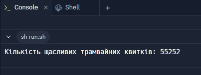

# Практична робота "Масиви, вирази, керування виконанням програми"

**Завдання №7.** Трамвайні квитки мають шестизначні номери, вважають якщо квиток «щасливий» то сума перших трьох цифр дорівнює сумі останніх. Знайти кількість щасливих квитків

## Опис

У рамках цієї практичної роботи реалізовано програму для **підрахунку кількості "щасливих"** трамвайних квитків за допомогою обробки числових даних у вигляді **масиву символів**. 

---

## Варіант завдання №7

📌 **Трамвайні квитки мають шестизначні номери, вважають якщо квиток «щасливий» то сума перших трьох цифр дорівнює сумі останніх. Знайти кількість щасливих квитків**

## 🧠 Логіка обчислення

Програма перебирає всі можливі значення від `000000` до `999999`, перетворює кожне число на рядок із 6 цифр і порівнює суму перших трьох цифр з останніми трьома.

Наприклад:
- Квиток `123321` — щасливий (`1+2+3 = 3+2+1`)
- Квиток `111222` — нещасливий (`1+1+1 ≠ 2+2+2`)

---

## 🖼️ Скриншот виконання (приклад роботи)

